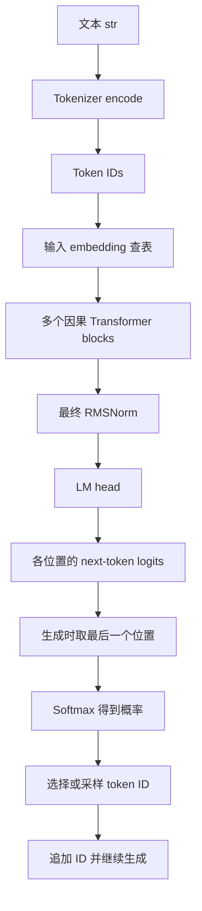

本笔记根据你的自主复述校准整理。主要依据：CS336 Assignment 1 PDF 第 2 节、第 3.1–3.4.1 节；训练与生成的区别参考第 4.1、5、6 节，仅补足总流程，不提前展开后续算法。

这里讨论的是本作业的自回归、decoder-only 文本语言模型。以下“补充”是教学解释，不是 PDF 逐字翻译。代码实现完成不等于所有数据集实验完成；本笔记不替代实验报告。

## 1. 先校准原来的复述

| 原理解 | 判断与修正 |
|---|---|
| 大语言模型不是黑盒，本质是给定文本预测下一个 token | 对本作业而言，核心正确。更准确地说，模型学习给定前缀时下一个 token 的条件概率分布。运算流程明确，不代表我们已完全解释所有学到的内部机制。 |
| 输入是 text，输出是 next token | 这是包含 tokenizer 与生成策略的系统视角。神经网络本身通常输入 token IDs，输出每个位置的 next-token logits；softmax 将其变成概率。 |
| embedding 将 ID 映射到语义向量 | embedding 是可学习的查表。训练后向量可能携带语义、句法等信息，但随机初始化时没有现成语义；同一个 token 的输入 embedding 本身不随当前上下文变化。 |
| 经过 Transformer 和 FFN 的数个 block | FFN 就在 Transformer block 内部。每个 block 包含 attention 子层与 FFN 子层，以及各自的归一化和残差连接。 |
| 最后一个 hidden vector 与词表各向量点积 | 是与 LM head 权重的各行点积。tokenizer 词表保存的是字节，不是神经向量；LM head 权重也不一定等于输入 embedding 权重。 |
| softmax 后选择最高分对应的向量 | 选择的是 token ID，而不是向量。取最大值是 greedy decoding；也可以按概率采样。softmax 只产生概率，不负责选择。 |
| 这就是预训练和推理的流程 | 这是两者共享的前向计算主干。预训练还需要真实目标、损失、反向传播和优化器更新；普通生成不更新权重。 |
| 初始词表是 0–255 | 初始普通 token 是全部 256 种单字节序列。0–255 是字节值范围；token ID 是词表编号，概念不同，当前实现让两者在初始阶段数值一致。 |
| 统计 pre-token，再选最高频 pair 加入词表 | 正确，但选的是各片段内部相邻 token 对的加权总频次，不是最高频的整个 pre-token。加入词表的是 pair 拼接产生的新 token，同时更新序列并记录规则。 |
| 新文本按 merge 列表先后顺序合并 | 符合 PDF 2.6 与当前实现。使用已学规则，不重新训练；每条规则从左到右做非重叠替换，不跨 pre-token 边界。 |
| decode 先合并 IDs，再查词表还原 | 应逐个 ID 查词表得到 bytes，再依次拼接全部 bytes，最后统一 UTF-8 解码。 |

## 2. 模型到底预测什么

### 原文要点译述

PDF 3.1：模型将 token IDs 映射成稠密向量，经过多个 Transformer blocks，最后通过一个可学习的线性投影（output embedding / LM head）得到 next-token logits。最后一个 block 后还需要归一化。

### 可以直接复述的版本

> 自回归语言模型学习的是：给定已经出现的 token 前缀，下一个 token 分别可能是什么。tokenizer 将文本转换为 IDs；embedding 将 IDs 映射成向量；因果 Transformer 逐层形成上下文表示；最后经过归一化和 LM head 得到词表上的 logits。生成时，将最后一个位置的 logits 转成概率，选择或采样一个 token ID，追加到前缀，继续预测。

数学目标是：

\[
p_\theta(t_{k+1}\mid t_1,\ldots,t_k).
\]

这里预测的是 token，不一定是完整单词、字符或句子。



RoPE 等位置信息机制也是完整模型的组成部分；当前只需知道模型需要表达位置关系，细节留待后续学习。

### 用形状检查流程

记 B 为 batch size，T 为序列长度，D 为 d_model，V 为 vocab_size。

| 对象 | 形状 | 含义 |
|---|---|---|
| token IDs | `[B, T]` | 离散编号，不是连续语义特征 |
| 输入 embedding 权重 E | `[V, D]` | 每个 ID 对应一行可学习向量 |
| embedding 输出 | `[B, T, D]` | 每个位置一个输入向量 |
| 每个 block 的输出 | `[B, T, D]` | 形状不变，表示内容被更新 |
| 最终归一化后的 H | `[B, T, D]` | 供输出投影使用 |
| LM head 权重 U | `[V, D]` | 每个候选 token 对应一行输出权重 |
| logits | `[B, T, V]` | 每个位置对所有候选 token 的分数 |
| 生成下一 token 时使用的 logits | `[B, V]` | 取时间维的最后一个位置 |

每个位置都有自己的 hidden vector。因果 attention 使位置 k 的表示只依赖位置 1 到 k，而不是未来 token。生成时取最后一个位置，是因为此时要预测整个已知前缀之后的 token。

对一个最终归一化后的向量 h，候选 token j 的分数为：

\[
z_j=U_j\cdot h,\qquad
p_j=\frac{e^{z_j}}{\sum_{v=1}^{V}e^{z_v}}.
\]

**必须分清三张“表”：**

- tokenizer 的 vocab：`ID → bytes`，负责文本表示。
- 输入 embedding E：`ID → 输入向量`，是神经网络参数。
- LM head U：每行用于计算某个候选 token 的输出分数，也是神经网络参数。

E 和 U 可以通过 weight tying 共享，但不能默认共享；PDF 将它作为后续可尝试的修改。点积评分也不等同于一定在做余弦相似度检索。

### 预训练与生成的区别

假设真实 token 序列是 `[A, B, C, D]`：

```text
训练输入：[A, B, C]
训练目标：[B, C, D]
```

训练时可以在一次因果前向计算中对多个位置计算预测，通过真实下一个 token 的负对数概率构造损失，反向传播并更新参数。不是先选一个预测 token，再拿这个离散选择去做通常的 next-token 交叉熵训练。

生成时通常固定参数，只知道前缀；得到下一 token 后追加它，再进行下一步预测。选概率最高者只是 greedy 策略，PDF 第 6 节还讨论采样、temperature 和 top-p。

## 3. Tokenizer：字节、词表与 BPE

### 字节为何保证覆盖

Unicode 给字符分配码点，UTF-8 把字符编码成字节。例如：

```text
“中” → U+4E2D → UTF-8 字节 E4 B8 AD
```

这三个字节的值都在 0–255 内，所以全部 256 种单字节 token 足以表示有效 UTF-8 文本，即使训练语料没有出现过“中”。BPE 决定能否用更少的 token 表示它，而不决定它能不能被表示。

单个 token 可以包含一个或多个字节，不必单独构成合法 UTF-8 字符。Python 遍历 `bytes` 得到整数；BPE 中的单字节 token 用长度为 1 的 `bytes` 表示。

### 训练：从文本学习词表和规则

PDF 2.4–2.5 的主流程：

1. 初始化全部 256 个单字节 token，另加入指定的 special tokens。
2. 按 special tokens 切分独立文本区域；特殊串不参与普通 merge 统计，不能把两边重新拼起来。
3. 对普通文本应用文档给出的正则表达式，得到 pre-tokens。术语是“正则表达式”，不是机器学习里的“正则化”。
4. 汇总相同 pre-token 的次数，再将它们表示为 UTF-8 单字节 token 序列。
5. 统计当前各序列内部的相邻 token 对，按片段频次加权。
6. 选频次最高的 pair；并列时选 pair 本身字典序较大的那个。
7. 将两段字节拼接成新 token，加入 vocab，并把 pair 追加到 merges；对各片段执行从左到右的非重叠合并。
8. 更新当前序列与 pair 计数，直到词表达到上限，或没有可合并的 pair。

**每轮合并的是两个 token，不一定是两个单字节。** 例如 `(b"ab", b"c")` 可产生 `b"abc"`。

pre-token 频次与 pair 频次不是同一张表。例如：

```text
序列 [a, b, a, b] 出现 3 次
(a, b) 对 pair 总频次贡献 2 × 3 = 6
(b, a) 对 pair 总频次贡献 1 × 3 = 3
```

重叠计数与非重叠替换也要分清：`[a,a,a]` 中 `(a,a)` 计数为 2，但本轮只能从左到右替换成 `[aa,a]`，不能重复使用中间的 a。

训练产物：

| 产物 | 类型 | 回答的问题 |
|---|---|---|
| vocab | `dict[int, bytes]` | 每个 ID 对应哪段字节？ |
| merges | `list[tuple[bytes, bytes]]` | 哪些 pair 可以合并，创建顺序是什么？ |

special tokens 占词表名额。若目标为 10,000，初始为 256 个字节 token 加 1 个独立特殊 token，则最多还有 9,743 个合并新增名额。

### Encode：应用已学规则

PDF 2.6 要求按训练时的创建顺序应用 merges。当前实现对每个普通 pre-token 都是：

```text
字符串 → UTF-8 单字节 token 序列
      → 按 merges 的先后顺序进行非重叠替换
      → 最终 token bytes 查反向词表
      → token IDs
```

编码时不重新统计频次、不重新训练，也不是直接贪心选词表中最长的字符串。

特殊串要作为整体直接输出其 ID。**训练统计时排除特殊串，编码时保留它的 ID**，两者不可混淆。普通 pre-token 之间不允许合并；空格也需要保留，例如 `"cat"` 和 `" cat"` 是不同片段。

### Decode：先拼字节，后解码

```text
IDs → 每个 ID 查 vocab 得到 bytes
    → 按原顺序拼接全部 bytes
    → 一次 UTF-8 解码 → str
```

不能要求每个 token 单独解码，因为一个字符可能分散在多个 token 中。PDF 要求任意有效词表 ID 序列拼出非法 UTF-8 时，以 U+FFFD 替换错误字节，对应 `errors="replace"`。

此处的 tokenizer decode 是 IDs 到文本的转换；生成章节中的 decoding 则是从模型分布选择 token 的过程，注意同一个英文词的两种语境。

## 4. 为什么索引和并行能加速训练

### 并行预分词

在文档边界划分大 chunk，每个工作进程读取自身范围、排除 special tokens、正则预分词并返回局部 Counter。主进程把同名 pre-token 的次数相加。

chunk 是读取与调度单位，pre-token 是 BPE 的合并边界，两者不是同一层。Counter 的缺失键读取为 0；`Counter.update` 累加次数，普通 `dict.update` 则覆盖同名值。

进程池先提交所有任务，再收集结果。仅把函数写进普通循环依次调用仍是串行。小输入上进程启动和通信开销可能抵消收益。

### 倒排索引与增量计数

当前实现为每条 pre-token 序列保留固定编号：

```text
sequences[id]：当前 token 序列
frequencies[id]：原片段频次
pair_counts[pair]：全局加权频次
pair_to_sequences[pair]：包含这个 pair 的序列编号集合
```

选中一个 pair 后，直接找到受影响编号。对每条受影响序列执行：撤销旧序列的计数与索引关联 → 合并 → 加入新序列的计数与索引关联。其他序列不用扫描。

这就是空间换时间。当前增量粒度仍是整条受影响序列，且 `max(pair_counts, ...)` 仍扫描所有候选 pair，不要把它理解成每轮所有操作都已变成常数时间。

必须保持的不变量：合并前后，每条序列拼出的字节相同，片段频次相同；全局 pair 计数与当前序列一致。

## 5. Transformer block 与 RMSNorm

### 两个子层，不是两种独立 block

attention 汇集不同位置的信息；FFN 对每个位置的向量做带非线性的特征变换，并在位置间共享参数。FFN 虽不直接混合位置，但它处理的输入已经可包含上下文信息；attention 自身也包含非线性操作，不能认为只有 FFN 有非线性。

在自回归模型中 attention 有因果限制：当前位置不能读取未来位置。

### Post-norm 与 pre-norm

用 F 表示一个子层：

\[
\text{post-norm: }y=\operatorname{Norm}(x+F(x))
\]

\[
\text{pre-norm: }y=x+F(\operatorname{Norm}(x)).
\]

本作业采用 pre-norm：

\[
h=x+\operatorname{Attention}(\operatorname{RMSNorm}_1(x)),
\qquad
y=h+\operatorname{FFN}(\operatorname{RMSNorm}_2(h)).
\]

残差加回的是子层的原输入，不是归一化后的输入。两个子层输出都为零时，block 输出等于 x。block 堆叠结束后，仍有最终的归一化。

不经过归一化的残差主路径提供直接的梯度传播路径，这是理解训练稳定性的直觉；并非保证所有网络、设置下训练都稳定的定理。

### RMSNorm 的计算与形状

对单个 token 的向量 a：

\[
y_i=\frac{a_i}{\sqrt{\frac1D\sum_{j=1}^{D}a_j^2+\varepsilon}}g_i.
\]

- RMS 根据每个 token 自己的最后一维计算；不减去均值。
- 同一 token 的所有分量共用一个 RMS 除数。
- g 是形状 `[D]` 的可学习参数，初始全 1；同一模块的所有 token 共享它，各 RMSNorm 模块通常有独立参数。
- eps 通常为 `1e-5`，位于根号内，防止零分母。
- 输入先转 float32 计算，最终转回原 dtype。

```text
输入                  [B, T, D]
平方后沿最后一维取均值  [B, T, 1]   ← keepdim=True
加 eps 后开方          [B, T, 1]
输入除以 RMS           [B, T, D]   ← 广播
逐维乘 g：[D]          [B, T, D]
```

所以输入 `[8,128,512]` 的均方结果是 `[8,128,1]`，可学习参数只有 512 个，不是 `8×128×512` 个。

忽略 eps，对正数 c，RMS(ca)=c RMS(a)，因此统一放大输入不会改变归一化后的结果。统一除以 RMS 保留分量比例，但逐维乘不同的 g 后，比例可以改变。输出不必均值为零，也不必在乘 g 后仍有 RMS=1。

## 6. 已接触的 PyTorch 模块知识

| 构件 | 应理解的作用 |
|---|---|
| `nn.Module` | 管理参数、子模块、设备迁移和状态保存加载 |
| `super().__init__()` | 初始化模块内部管理结构，应在注册参数前调用 |
| `__init__` | 创建、注册并初始化持久参数，不随每次 forward 重建 |
| `nn.Parameter` | Tensor 子类，赋给 Module 属性后自动注册，默认 requires_grad=True |
| `forward` | 使用已有参数计算输出；通常通过 `layer(x)` 调用 |
| `backward` 与优化器 | 前者计算梯度，后者更新参数，Parameter 不会自行学习 |

无偏置 Linear 的权重存成 `[out_features, in_features]`。输入 `[..., in_features]` 的计算为 `X @ W.T`，也可写 `torch.einsum("...i,oi->...o", x, W)`。PyTorch 一维 tensor 本身不区分行列向量，形状约定与底层内存排列要区分。

本作业 Linear 初始化：基础正态分布均值为 0，标准差为 `sqrt(2/(in_features+out_features))`，在正负 3 倍标准差处截断。`torch.empty` 只分配空间；`trunc_normal_` 原地填充初值。

## 7. 下一次复习时的自测

1. tokenizer 的 vocab、输入 embedding 和 LM head 权重各保存什么？
2. 生成为何取最后位置？训练为何能对多个位置计算损失？
3. special token 在训练统计与编码中分别如何处理？
4. `[a,a,a]` 的 `(a,a)` 计数与本轮可执行的合并次数为什么不同？
5. 倒排索引为什么保存固定编号？序列变化后哪些状态必须同步更新？
6. pre-norm 的残差为什么加原始 x，而不是 Norm(x)？
7. `[8,128,512]` 的 RMS 统计形状与 g 的形状分别是什么？

当前必须掌握：表示层次、形状、BPE 状态更新、残差路径、RMSNorm 的统计维度。attention 内部 Q/K/V、RoPE、SwiGLU、优化器细节后续再展开，不需要今天一次掌握。

## Recap

Tokenizer 解决文本与离散 IDs 的转换，语言模型学习 IDs 前缀到 next-token 分布；训练通过损失更新参数，生成通过选择或采样扩展序列。当前已理解 BPE、索引加速、Linear、pre-norm 残差结构和 RMSNorm，复习时重点分清“字节与向量”“输入表示与输出评分”“共享参数与逐 token 统计”。
