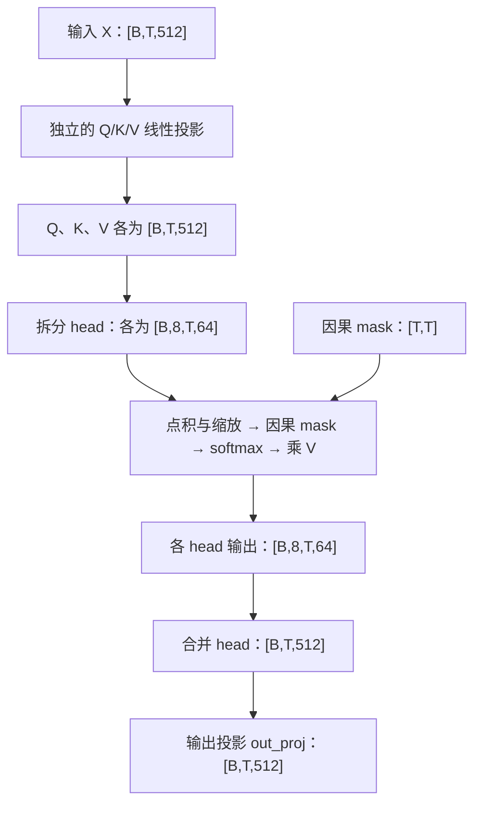

记录日期：2026-09-11。接续 [SwiGLU 与 RoPE 笔记](/notes/02-swiglu-and-rope/)。依据本次学习交互、本地 Assignment 1 说明、实现与测试接口整理。例子用于解释计算，不代表模型内部特征已有确定的人类语义。

## 1. 本次进度与验证边界

| 组件 | 本次进展 | 验证证据 |
| --- | --- | --- |
| softmax | 完成减最大值、指数、归一化与 adapter | 助手直接检查大数输入、`dim=-1` 和 `dim=0` 通过；接通 adapter 后用户报告测试通过 |
| scaled dot-product attention | 使用 einops.einsum 完成点积、缩放、mask 和加权求和 | 用户报告对应测试通过 |
| 不带 RoPE 的多头 attention | 完成四个投影、拆分与合并 head；adapter 创建因果 mask 并加载权重 | 助手实际运行 `test_multihead_self_attention` 通过 |
| 独立 RoPE | 沿用已有旋转实现 | 助手本次实际运行 `test_rope` 通过 |
| 带 RoPE 的多头 attention | 曾尝试接入，随后暂时注释旋转，先完成无 RoPE 路径 | `run_multihead_self_attention_with_rope` 仍为 `NotImplementedError`，尚未完成 |

还直接验证过：输入 `[2,3,16]` 返回同形状；提供因果 mask 后，改变最后一个 token 不影响前面位置的输出。该检查验证基本形状与因果行为，不替代完整数值测试。未运行整个作业测试套件。

测试入口是 tests/adapters.py，相关命令：

```bash
uv run pytest -k test_softmax_matches_pytorch
uv run pytest -k test_scaled_dot_product_attention
uv run pytest tests/test_model.py::test_multihead_self_attention
uv run pytest tests/test_model.py::test_rope
```

## 2. Softmax：分数如何变成权重

Softmax 把一组实数分数变成非负、总和为 1 的权重：

\[
p_i=\frac{e^{s_i}}{\sum_j e^{s_j}}.
\]

指数将分数转换为正数，再除以共同总和完成归一化。例如：

```text
分数       [2, 1, 0]
指数       [7.389, 2.718, 1]
归一化权重 [0.665, 0.245, 0.090]（近似）
```

直接除以原始分数之和不够通用：分数可能为负，总和也可能为零。Softmax 产生权重，后续乘 V 才执行信息汇集。

### 为什么减最大值

很大的指数会超出浮点表示范围。对同组所有分数减去共同常数 m，不改变数学结果：

\[
\frac{e^{s_i-m}}{\sum_j e^{s_j-m}}
=\frac{e^{-m}e^{s_i}}{e^{-m}\sum_j e^{s_j}}
=\frac{e^{s_i}}{\sum_j e^{s_j}}.
\]

选择最大值作为 m，使指数输入最大为 0，指数结果最大为 1。比如 `[1002,1001,1000]` 先变成 `[0,-1,-2]`。这是对有限分数的稳定计算方法；不能据此认为任意非有限输入都可正常归一化。

### 本次校准：输出形状与归约形状不同

对 attention 分数 `[B,T,T]`，固定 batch 和 query 位置，沿最后的 key 位置轴归一化：

| 操作 | 形状 |
| --- | --- |
| 输入分数 | `[B,T,T]` |
| 沿 `dim=-1` 取最大值，`keepdim=True` | `[B,T,1]` |
| 减最大值，再逐元素取指数 | `[B,T,T]` |
| 沿 `dim=-1` 求指数之和，`keepdim=True` | `[B,T,1]` |
| 指数除以总和 | `[B,T,T]` |

最初将“取最大值后形状”回答成 `[B,T,T]`；这是最终 softmax 输出的形状。归约把每行变成一个数，保留轴时该轴长度为 1。随后正确判断出分母形状为 `[B,T,1]`。

同一行的每个元素除以该行总和，所以该行相加为 1；广播负责复用分母。作业函数应使用传入的 `dim`，不能写死为最后一轴。

## 3. 普通函数与 nn.Module

| 组件 | 管理的状态 | 当前形式 |
| --- | --- | --- |
| softmax、scaled dot-product attention | 无持久参数或缓存 | 普通函数 |
| Linear | 可学习权重 | nn.Module |
| RoPE | 固定的 sin/cos 缓存 | nn.Module |
| 多头 self-attention | 四个可学习投影子模块 | nn.Module |

普通函数中的 Tensor 运算也可参与 autograd。继承 nn.Module 不是自动求导的前提；它用于组织计算、管理参数与其他状态。无状态操作也可以包装成模块，但这里不需要。

本次曾询问 `self.q_proj` 是什么，它是自定义名称，表示 query projection 子模块：

```python
# __init__：创建并保存模块及其权重
self.q_proj = Linear(d_model, d_model)

# forward：用本次输入执行计算
q = self.q_proj(x)
```

`self.q_proj` 是模块，`self.q_proj.weight` 是参数，`q` 是计算结果 Tensor。数学上，按代码的行向量约定，`Q = X @ W_Q.T`。

## 4. Q、K、V 与 attention 输出的意义

Attention 根据 Q 与 K 的匹配分数，对 V 加权求和：

\[
A=\operatorname{softmax}\left(\frac{QK^\top}{\sqrt{d_k}}\right),
\qquad O=AV.
\]

- Query：某个位置用于寻找信息的向量。
- Key：某个位置用于计算匹配程度的向量。
- Value：该位置实际提供的特征向量。

这些是计算角色，不是预先指定的人类语义。Self-attention 通常从同一个 X 经三个不同的可学习投影产生 Q、K、V。投影矩阵是参数，Q/K/V 是本次计算的数据。

### 两次矩阵乘法

```text
Q：[3,4]，K：[3,4]，V：[3,2]
Q @ K.T → [3,3]
softmax 后的 A → [3,3]
A @ V → [3,2]
```

本次两次输出形状均判断正确。进一步需要把形状连接到含义：

- 分数矩阵的第 i 行、第 j 列表示 query i 与 key j 的点积（随后缩放）。
- A 的每一行，是一个 query 对所有可读取位置分配的权重。
- O 的每一行，是这个 query 汇集得到的完整向量。

\[
O_i=\sum_j A_{i,j}V_j,
\qquad O_{i,r}=\sum_j A_{i,j}V_{j,r}.
\]

i 指 query 位置，j 指 key/value 位置，r 指 value 的某个分量。后一式只是前一式展开到单个元素，不是另一种操作。

例如权重 `[0.6,0.3,0.1]`，value 分别为 `[10,0]`、`[0,10]`、`[5,5]`，汇集结果为 `[6.5,3.5]`。A 保存“各读多少”，O 保存“按这些权重汇集到的特征”，O 还不是词表概率。

### V 的宽度代表什么

`V:[T,d_v]` 表示 T 个位置，每个位置用 d_v 个数表达可供读取的特征。各坐标由训练学出，不预设某一维专门代表人物、颜色或语法；一个属性可以分散在多个维度，一个维度也可能参与多种属性。

后面层的输入已融合上下文，因此某个位置的 V 也可能包含其他位置的信息。

序列从 100 个 token 变成 200 个，`[100,64] → [200,64]`：行数变多，每行宽度不变，因为每个位置都使用同一个投影。用户后续明确表示已理解这一形状关系，应避免反复停留在同类基础检查。

## 5. 为什么除以 sqrt(d_k)

点积是 d_k 个乘积的和。作简化假设：Q/K 分量独立、均值为 0、方差为 1，则：

\[
\operatorname{Var}(q^\top k)=d_k,
\qquad \operatorname{Std}(q^\top k)=\sqrt{d_k}.
\]

维度增长让分数的正负波动增大，不意味着分数必然变得更正。除以平方根后，在这些假设下方差为 1。

分数差太大会使 softmax 过于集中、接近饱和：

```text
softmax([1,2,3])    ≈ [0.090, 0.245, 0.665]
softmax([10,20,30]) ≈ [0.000, 0.00005, 0.99995]
```

接近饱和时，softmax 对分数的导数会很小。真实训练向量不严格满足上述独立性和方差假设；推导解释缩放设计依据，不保证所有训练阶段的分数方差精确等于 1。

| 操作 | 是否改变数学上的权重 | 目的 |
| --- | --- | --- |
| 所有分数减同一最大值 | 不改变 | 避免指数溢出 |
| 除以 sqrt(d_k) | 通常改变 | 控制分数差的尺度 |

## 6. 用 einops.einsum 表达计算

本次新增学习偏好：相关张量操作优先学习 einops 和 einsum，讲清轴名、形状与求和关系。该偏好已写入 CS336 根目录的 AGENTS.md。

点积评分：

```python
scores = einops.einsum(
    Q, K, "... queries d_k, ... keys d_k -> ... queries keys"
)
```

`d_k` 没有出现在输出中，表示沿特征轴求和；`queries` 和 `keys` 都保留，产生所有位置配对。即使两个轴长度相同，也不能因而使用同一个名字。

加权求和：

```python
output = einops.einsum(
    weights, V, "... queries keys, ... keys d_v -> ... queries d_v"
)
```

`keys` 没有出现在输出中，表示沿读取位置求和；输出保留 query 位置与 value 特征。

`rearrange` 用于重排、拆分、合并轴；`einsum` 用于乘积与求和。这里 `...` 保留前置 batch、head 等维度。

## 7. 因果 mask 与位置编号

位置 i 的输出用于预测下一个 token，因此不能读取未来位置 j > i。允许范围包含自己：

\[
\text{mask}[i,j]=(j\le i).
\]

```text
        key 0  1  2  3
query 0     ✓  ×  ×  ×
      1     ✓  ✓  ×  ×
      2     ✓  ✓  ✓  ×
      3     ✓  ✓  ✓  ✓
```

作业约定 True 表示允许读取，False 表示屏蔽。在 softmax 之前将不允许的分数填为负无穷：

```text
[2,1,3,4] → [2,1,-∞,-∞] → [0.731,0.269,0,0]
```

因为 exp(-∞)=0，屏蔽项不参与分母。不能仅在 softmax 后将对应权重置零，否则剩余权重通常不再归一化。纯因果 mask 保留对角线，每行至少有一个允许位置；任意外部 mask 若屏蔽整行，则需要另外定义处理策略。

### arange 这一行是什么意思

```python
positions = torch.arange(
    in_features.shape[-2], device=in_features.device
)
```

若输入为 `[B,T,d_model]`，`shape[-2]` 取得形状中的 T，不是读取某个 token。`arange(T)` 创建整数编号 `[0,...,T-1]`；`device` 让它位于与输入相同的设备。这些是局部位置编号，不是词表 ID 或特征向量。

用 einops 显式表达广播轴：

```python
query_positions = einops.rearrange(positions, "q -> q 1")  # [T,1]
key_positions = einops.rearrange(positions, "k -> 1 k")    # [1,T]
mask = key_positions <= query_positions                  # [T,T]
```

长度为 1 的轴让广播计算所有位置对的比较。mask 可复用于不同 batch 和 head。

## 8. 多头 attention 的动机与完整形状流

本次复述：“单个 head 对一个 token 位置只产生一个标量权重。”核心方向正确，但应精确为：**单个 head 为每对 query–key 位置产生一个标量权重，为每个 query 产生一整组位置权重。**

同一 head 中，某个位置权重乘整个 value 向量，各分量共享这组位置权重。不同 head 使用不同投影，可以让不同特征子空间使用不同的位置权重；具体职责由训练决定。

本作业使用 `d_head = d_model // num_heads`，并要求整除。先做一个大的 Q 投影，再把输出拆成 H 组，数学上等价于 H 组小投影；各组对应不同权重，而拆分操作本身不包含可学习参数。

以 `d_model=512`、`H=8`、`d_head=64` 为例：



拆分与合并：

```python
# heads 或 head_dim 至少指定一个，才能推断拆分比例
q = einops.rearrange(
    q, "... seq (heads head_dim) -> ... heads seq head_dim",
    head_dim=self.head_dim,
)

merged = einops.rearrange(
    output, "... heads seq head_dim -> ... seq (heads head_dim)"
)
```

合并必须把同一个 token 的各 head 拼在一起；输出投影再混合这些特征。当前类要求外部传入 mask，adapter 负责构造因果 mask。该类并不自动保证任意调用都具有因果性。

模块职责：

```text
__init__
  保存维度与 head 数
  创建 q_proj、k_proj、v_proj、out_proj

forward(x, mask)
  投影 → 拆分 → 调用已有 attention → 合并 → 输出投影
```

RMSNorm 与残差由外层 Transformer block 组织，不属于当前 attention 类。

## 9. 本次实际遇到的错误与定位过程

| 问题 | 原因与修正 |
| --- | --- |
| softmax 实现正确但测试失败 | adapter 仍抛出 NotImplementedError，测试没有进入实现；导入函数并转交参数 |
| 在 `__init__` 中直接 rearrange q/k/v | 输入尚未提供，q/k/v 未定义；先在 forward 中调用投影，再拆分 |
| einops 无法推断 heads 和 head_dim | 只有两者乘积，拆分不唯一；传入 heads 或 head_dim |
| 只写固定 batch 轴 | 限定了输入 rank；改用 `...` 支持任意前置 batch 维度 |
| 导入 `tests.conftest.mask` 后 masked_fill 报类型错误 | 导入的是 pytest fixture 对象，不是 Tensor；与 0 比较得到 Python bool |
| 删除 fixture 导入后出现 NameError | 移除错误来源并没有创建 mask；必须在调用前构造实际布尔 Tensor |

fixture 的随机 mask 即使被 pytest 求值，也不是这里所需的因果 mask。模型维度同样来自构造参数，不应从 conftest 导入 fixture 来当配置。

最终 adapter 的权重对应关系为 q→q_proj、k→k_proj、v→v_proj、o→out_proj，在 `torch.no_grad()` 中用 `weight.copy_(...)` 加载。随后创建因果 mask 并调用模块，助手实际运行测试通过。

当前构造的 Linear 默认位于 CPU、采用默认 dtype；若后续支持 GPU 或其他输入 dtype，需让模块状态与输入匹配。当前测试通过不代表已验证所有设备和精度组合。

## 10. 下次从哪里继续：接入可选 RoPE

无 RoPE 路径已经完成，不要重新实现 attention 核心。下一步：

1. 保留无 RoPE 路径；`run_multihead_self_attention` 明确要求不使用 RoPE。
2. 在构造函数中接收所需配置，创建可选的 RoPE 子模块，复用缓存；不要每次 forward 重建。
3. RoPE 使用 `d_head`，在拆分 head 后仅旋转 Q、K，V 不旋转。
4. 接收外部 `token_positions`；未提供时可使用当前序列的默认位置。
5. `theta`、`max_seq_len` 应遵循传入配置，不固定为 10000 或本次序列长度；缓存必须覆盖实际位置编号。
6. 接通带 RoPE 的 adapter 并验证对应测试。

现有 RoPE 的广播边界：

| Q/K | token_positions | 处理 |
| --- | --- | --- |
| `[B,H,T,D]` | `[T]` | 查表结果 `[T,D/2]` 可直接广播 |
| `[B,H,T,D]` | `[B,T]` | 先补 head 轴为 `[B,1,T]`，查表后系数为 `[B,1,T,D/2]` |

后者可用 `einops.rearrange(token_positions, "... seq -> ... 1 seq")`。位置索引用于查旋转系数；因果 mask 用于限制读取范围，二者职责不同。

## 11. 学习深度与后续复述

必须掌握：

- softmax 的归一化轴、keepdim 与广播，减最大值为何不改变结果。
- Q/K/V 的职责，权重矩阵与汇集结果的区别。
- einsum 中特征轴求和与位置轴求和，rearrange 的拆分与合并。
- 模块、权重、输入与计算结果的区别；构造与 forward 的职责。
- 因果 mask 的方向、布尔语义和应用时机。

理解原理即可：缩放因子的方差推导、多头允许不同子空间采用不同权重的动机。当前可以跳过 GPU kernel、FlashAttention、复杂 KV cache 和长上下文位置扩展。

复述时优先解释真实计算：“某个 query 的一行权重如何变成一个输出向量？”以及“`[B,H,T,T]` 每条轴代表什么？”本次已多次明确序列长度与特征宽度的区别，后续不要机械重复同类形状问答，应在实现和调试中检查迁移能力。

## Recap

今天完成了从分数归一化到因果多头 attention 的主线，将数学公式落实为 einsum、rearrange、模块状态和测试 adapter。不带 RoPE 的多头 attention 已实际通过对应测试；下次接入可选 RoPE，重点处理缓存生命周期与位置索引广播。
